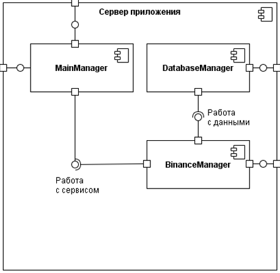

# Backend- сервер
## HLD
### Компоненты сервера:


База данных с PostgreSQL заменена на SQLite3 из-за удобства пользования

### База данных:
#### Users:
```diff
id: integer key
tid: integer not null unique
```
#### Currencies:

*Курс из целочисленного количества центов переведён на число с плавающей запятой, ибо с валютами так и получается в общем случае. В особенности в криптовалютах. "Не храните деньги во float'ах" (c) А. Мартынов.*
```diff
id: integer key
- usdvalue: integer not null
+ usdvalue: float not null
flair: text not null unique
last_event: datetime
```
#### SubscriptionsCoin
```diff
id: integer key
uid: int foreign key Users(key) not null
cid: int foreign key Currencies(key) not null
+ target: float
+ active: boolean
last_event: datetime
```
#### SubscriptionsRate

*При создании HLD у меня, @atik1n, было мнение, что нам нужна будет подписка на курс чего-то к чему-то помимо курса к доллару. Я ошибся, но таблица попала в HLD. Посему она удалена из реализации.*
```diff
- id: integer key
- uid: int foreign key Users(key) not null
- rid: int foreign key Rates(key) not null
- last_event: datetime
```
#### Rates

*Было решено, что данное представление не нужно, так как проще и оптимальнее расчитывать данный параметр в момент вызова, чтобы избежать лишние циклы чтения/записи.*
```diff
- id: integer key
- cid_from: int key Currencies(key)
- cid_to: int key Currencies(key)
- rate: float not null
- last_event: datetime
```

### API

```diff
+`/history/get`
+   `symbol`* - пара валют, например `BTCUSDT` ЛИБО `from`* и `to`* - отдельно валюты, например `BTC`
+   `candle_size` - размер свечи, например `1d`
+   `date_from` - ISO-строка даты, откуда начать отсчёт истории
+   `date_to` - дата конца истории (по умолчанию - сейчас)
+   `interval` - сколько времени от `date_to` учесть, если не передан `date_from` (по умолчанию `07`)
`/currencies/get`
    `flair` - название валюты, например `BTC`
-   `binance` - брать ли данные с Binance, а не внутренней базы данных (по умолчанию `False`)
+   `fromBinance` - брать ли данные с Binance, а не внутренней базы данных (по умолчанию `False`)
`/currencies/update` - Требует авторизацию
    `flair`* - название валюты для обновления, например `BTC`
`/currencies/subscribe` - Требует авторизацию
    `tid`* - ID пользователя Telegram
    `flair`* - название валюты для обновления, например `BTC`
+   `target` - целевое значение валюты, когда прислать уведомление
-`/user/subscribe/unsubscribe` - Требует авторизацию
+`/currencies/unsubscribe` - Требует авторизацию
    `tid`* - ID пользователя Telegram
-   `sub`* - ID подписки
+   `flair`* - название валюты для обновления, например `BTC`
`/rates/get`
+   `symbol` - пара валют, например `BTCUSDT` ЛИБО `from` и/или `to` - отдельно валюты, например `BTC` NB: Если передан только `from` или `to`, будет выведена выборка курсов из или в эту валюту
-   `binance` - брать ли данные с Binance, а не внутренней базы данных (по умолчанию `False`)
+   `fromBinance` - брать ли данные с Binance, а не внутренней базы данных (по умолчанию `False`)
+`/user/associate` - Требует авторизацию
+   `tid`* - ID пользователя Telegram, что будет добавлен в базу/выбран из базы
-`/user/subscribes/get` - Требует авторизацию
+`/user/subscriptions` - Требует авторизацию
+   `tid`* - ID пользователя Telegram, чьи подписки вывести
```